# Projeto de Human Resources Analytics

## Descrição Inicial ##

O projeto possui como principal interesse, <b>o maior entendimento dos atributos que podem levar ao churn</b>.

O objetivo é destrinchar as características de funcionários e as relações deles com a empresa, para buscar quantificar a possibilidade de um possível churn no decorrer do tempo.

O projeto conta com três principais etapas:
<li> Arquitetura dos dados </li>
<li> Entendimento e Processamento dos Dados </li>
<li> Análise de Dados</li> 

Principais Ferramentas:
<li><b>Airflow</b></li>
<li> <b>Minio</b></li>
<li><b>SQL</b></li>
<li><b>Python</b></li> 

## Arquitetura de Dados

Nessa etapa, o objetivo foi desenhar a arquitetura, isto é, o caminho pelo qual os dados partiriam desde o computador até a visualizaçaõ de dados e predição deles. Abaixo, pode-se observar o desenho dessa arquitetura:

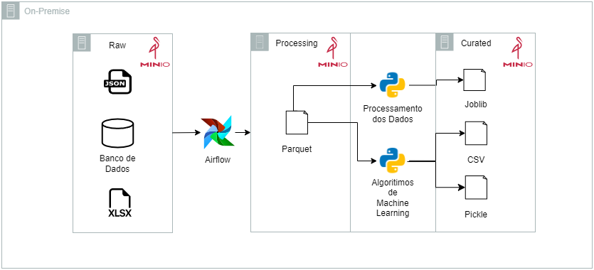

<li> Tudo se inicia com os arquivos .xlsx, .json e um arquivo do MySQL que são adicionados ao Data Lake, correspondido aqui pelo Minio </li> 

<li>Após isso, os dados são processados através de <b>dags</b> no Airflow, juntando esses diferentes arquivos em um único arquivo performático com extensão .parquet</li> 

<li>A partir desse dado em .parquet, as análises exploratórias serão realizadas e também serão realizadas as predições através da utilização e algoritmos de machine learning. </li> 

<li>Ao final da análise, realizou-se uma clusterização, resultando em um arquivo .joblib, ao final da análise exploratória. Já ao final da predição por machine learning, os arquivos de database.csv e o arquivo do modol.pkl são gerados e colocados juntos ao arquivo .joblib na camada Curated.</li> 

Essa é uma arquitetura simples e totalmente on premise, que utiliza os conceitos de Data Lake e automação das etapas com o Minio e o Airflow, respectivamente. O propósito maior dessa arquitetura é criar um pipeline de entrada de dados coeso para um melhor processamento e análise. Mesmo simples, ela se mostra eficaz ao trabalhar com diferentes tipos de dados e ter todo o processamento atribuído em linguagem python, desde as dags no Airflow até a análise utilizando bibliotecas como Pandas, Matplotlibe e Seaborn e finalizando com as etapas de Machine Learning.

## Entendimento e Processamento dos Dados

- Quais são os fatores que influenciam para um colaborador deixar a
empresa?

- Como reter pessoas?

- Como antecipar e saber se um determinado colaborador vai sair da
empresa?

## Análise dos Dados

Na etapa de Análise Exploratória de Dados foram descobertos os vários insights importantes abaixo, através de cruzamentos entre os dados utilizando as bibliotecas disponíveis no Python: 

<b>1 - Matriz de Correlação (Heatmap):</b>

 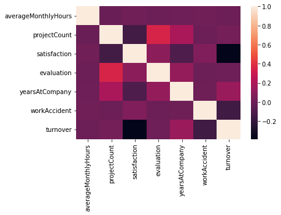 

<li>Existe uma correlação positiva entre os atributos projectCount e Evaluation.</li> 

<li>Faz sentido que empregados que estão envolvidos em mais projetos, trabalham mais e tem melhor avaliação.</li> 

<li>Existe uma correlação negativa entre os atributos satisfaction e turnover.</li> 

<li>Podemos assumir que empregados que mais deixam a empresa estão menos satisfeitos.   

<b>2 - Distribuição dos Atributos:</b>

 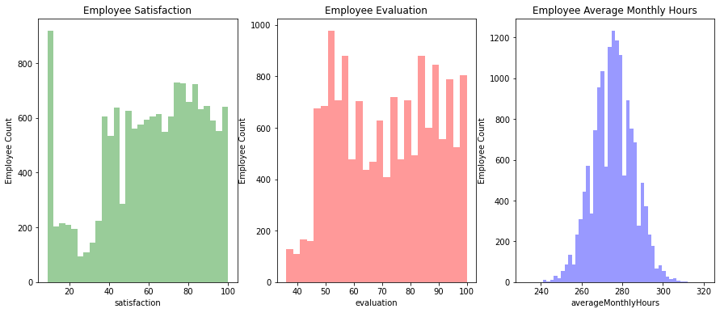 

Examinando a distribuição de alguns atributos do conjunto de dados:

<li>Satisfaction - Existe um pico de empregados com baixa satisfação, mas a maior concentração está em 60 a 80.</li> 
<li>Evaluation - Temos uma distribuição bimodal de empregados com avaliações baixas, menor que de 60 e altas, maior que 80.</li> 
<li>AverageMonthlyHours - A concentração da quantidade de horas trabalhadas nos últimos 3 meses está ao redor da média em 275 horas.</li>   

<b>3 - Salário x Turnover:</b>

 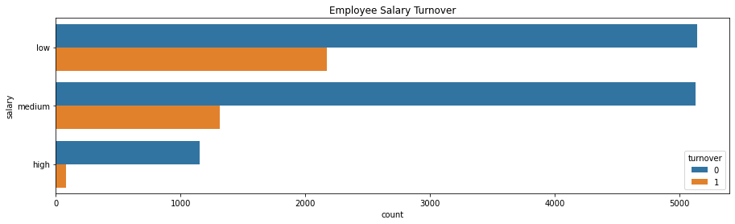 

Analisando-se a relação entre salário e turnover no conjunto de dados:

<li>A maioria dos empregados que saíram tinha salário baixo ou médio.</li> 
<li>Quase nenhum empregado com alto salário deixou a empresa.</li>   

<b>4 - Departamento x Turnover:</b>

 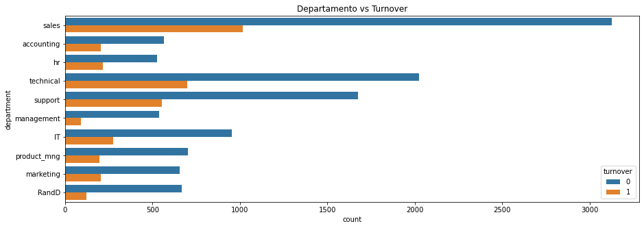 
 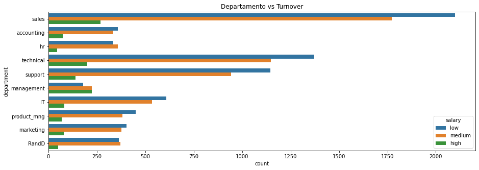 

Analisando-se mais informações sobre os departamentos da empresa:

<li>Os departamentos de vendas, técnico e suporte são top 3 departamentos com maior índice de turnover.</li> 
<li>O departamento management tem o menor volume de turnover.</li>   

<b>5 - Quantidade de Projetos x Turnover:</b>

 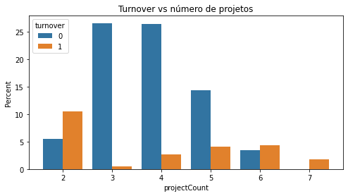 

Insights interessantes que se podem encontrar aqui:

<li>Mais da metade dos empregados com 2,6 e 7 projetos deixam a empresa.</li> 
<li>A maioria dos empregados que permancem na empresa estão envolvidos de 3 à 5 projetos.</li> 
<li>Todos os empregados que estavam inseridos 7 projetos deixaram a empresa.</li> 
<li>Existe uma pequena tendência de crescimento no índice de turnover em relação à quantidade de projetos.</li>   

<b>6 - Avaliação x Turnover:</b>

 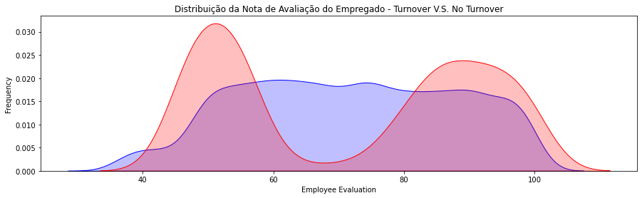 

Insights interessantes que se podem encontrar aqui:

<li>Temos uma distribuição bimodal para o conjunto que deixou a empresa.</li> 
<li>Colaboradores com baixa performance tendem a deixar a empresa.</li> 
<li>Colaboradores com alta performance tendem a deixar a empresa.</li> 
<li>O ponto ideal para os funcionários que permaneceram está dentro da avaliação de 60 à 80.</li>   

<b>7 - Satisfação x Turnover:</b>

 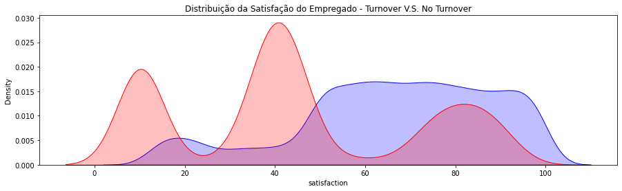 

Analisando-se o conjunto desses dados, pode-se notar que:

<li>Empregados com o nível de satisfação em 20 ou menos tendem a deixar a empresa.</li> 
<li>Empregados com o nível de satisfação em até 50 tem maior probabilidade de deixar a empresa também.</li>   

<b>8 - Avaliação x Quantidade de Projetos:</b>

 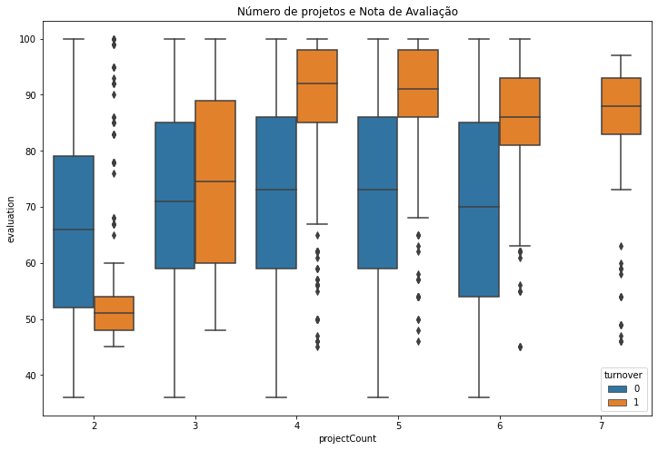 

<li>Há um aumento na avaliação para os funcionários que realizaram mais projetos dentro do grupo de quem deixou a empresa.</li> 
<li>Para o grupo de pessoas que permaneceram na empresa, os empregados tiveram uma pontuação de avaliação consistente, apesar do aumento nas contagens de projetos.</li> 
<li>Empregados que permaneceram na empresa tiveram uma avaliação média em torno de 70%, mesmo com o número de projetos crescendo.</li> 
<li>Esta relação muda drasticamente entre os empregados que deixaram a empresa. A partir de 3 projetos, as médias de avaliação aumentam consideravelmente.</li> 
<li>Empregados que tinham dois projetos e uma péssima avaliação saíram.</li> 
<li>Empregados com mais de 3 projetos e avaliações altas deixaram a empresa.</li>   

<b>9 - Avaliação x Satisfação:</b>

 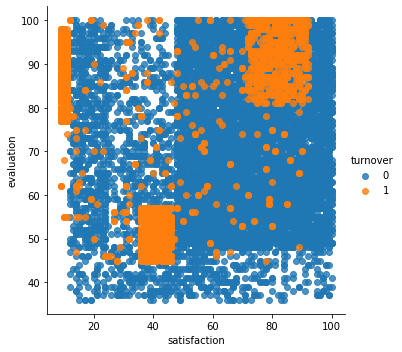 

A partir desse cruzamento, pode-se observar 3 diferentes grupos segregados:

<b>Cluster 1 (Empregados insatisfeitos e trabalhadores):</b> A satisfação foi inferior a 20 e as avaliações foram superiores a 75.
<li>Há um aumento na avaliação para os funcionários que realizaram mais projetos dentro do grupo de quem deixou a empresa.</li> 

 <b>Cluster 2 (Empregados ruins e insatisfeitos):</b> Satisfação entre 35 à 50 e as suas avaliações abaixo de ~ 58.  

<b>Cluster 3 (Empregados satisfeitos e trabalhadores):</b> Satisfação entre 75 à 90 e avaliações superiores a 80.
<li>O que poderia significar que os funcionários neste grupo eram "ideais".</li> 
<li>Eles amavam seu trabalho e eram altamente avaliados por seu desempenho.</li>   

## Conclusão

<li> A empresa tem uma rotatividade de 24%</li> 

<li>Podemos assumir que os empregados que mais deixam a empresa estão menos satisfeitos.</li> 

<li>Existe um valor considerável de empregados insatisfeitos.</li> 

<li> A maioria dos empregados que saíram tinha salário baixo ou médio.</li> 

<li>Os departamentos de vendas, técnico e suporte são top 3 departamentos com maior índice de turnover.</li> 

<li>Todos os empregados que estavam inseridos sem muitos projetos deixaram a empresa.</li> 

<li> Colaboradores com baixa performance tendem a deixar a empresa.</li> 

<li>Colaboradores insatisfeitos com a empresa têm uma maior tendência para evadir.</li> 

Esses fatores podem auxiliar na tomada de de decisões estratégicas pela equipe de RH em conjunto com outras áreas como Financeiro, para entender melhor o perfil das pessoas que tendem a deixar a empresa, se o problema (não único, mas claramente sempre expoente) do salário pode ser contornado de outras maneiras, como benefícios. Ademais, a compreensão dos dados também ajuda a entender a desmotivação de alguns colaboradores, visto que mesmoc com salários melhores e anos de companhia, eles podem vir a se sentir desmotivados ou sem novos desafios. Logo casos opostos com soluções distintas que podem ser melhor entendidos através de uma análise dos dados.

A arquitetura já está preparada para a inclusão de uma etapa de machine learning, buscando-se prever futuras possibilidades de saídas de profissionais para enriquecer ainda mais as estratégias para redução do número de turnover.
